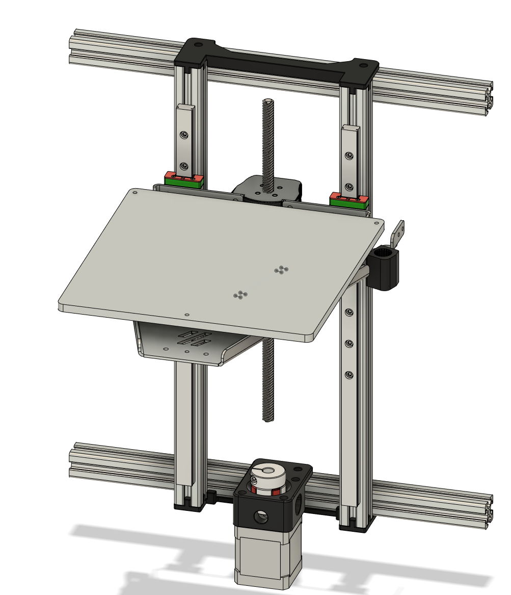

# Tiny-M_190_Kirigami_Bed
WIP Adaptation of v0 Kirigami Bed for 190mm build Tiny-M

Need to do:
- Finalize Z Endstop position.

Created with original Tiny-M CAD located at https://github.com/gsl12/Tiny-M. 

Modified from christophmuellerorg's original v0 Kirigami bed located at: https://github.com/christophmuellerorg/voron_0_kirigami_bed.
